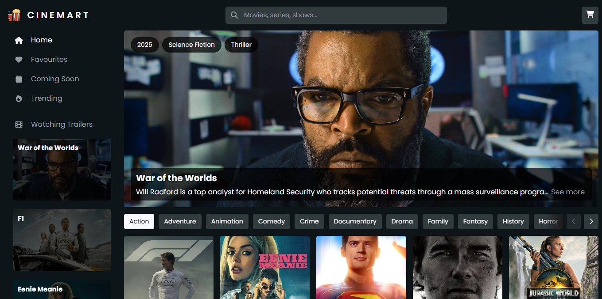
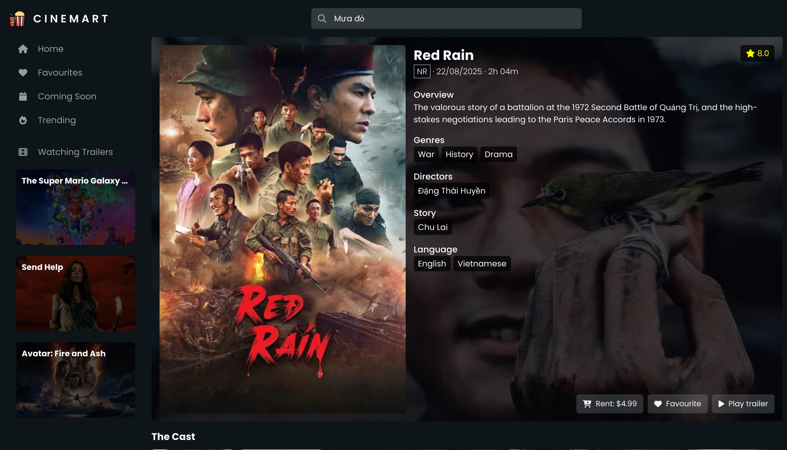
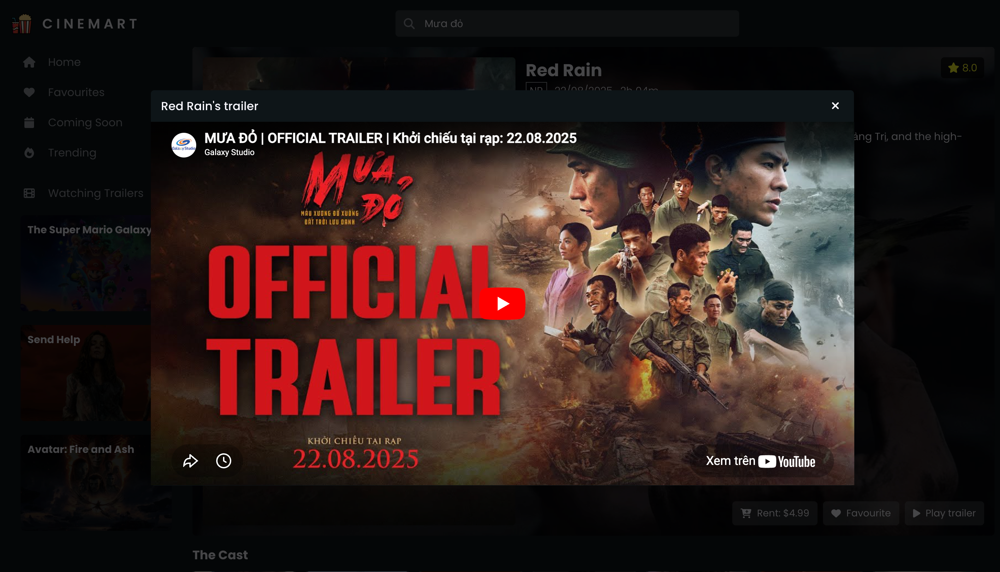

## CineMatch - Movie Recommendation System

### Overview

- A shopping cart web application (used to be) built as part of [The Odin Project](https://www.theodinproject.com/lessons/node-path-react-new-shopping-cart)
  curriculum. Now it serves as the client for [CineMatch API](https://github.com/zadnap/cinematch-api).
- This project focuses on practicing React, React Router, and state management by creating a simple e-commerce experience with product browsing and cart functionality.
- See the project in action: [CineMatch](https://cinematch-client-xi-liart.vercel.app/).

### Features

- Browse a list of products with images and details.
- Responsive design for desktop and mobile.
- Client-side routing with React Router.

### Built With

- [React](https://react.dev/)
- [React Router](https://reactrouter.com/)
- [SCSS](https://sass-lang.com/) and [CSS Module](https://create-react-app.dev/docs/adding-a-css-modules-stylesheet/)
- [Vite](https://vite.dev/)

### Installation & Usage

1. Clone the repository:

```
git clone https://github.com/zadnap/cinematch-client
```

```
cd cinematch-client
```

2. Install dependencies:

```
npm install
```

3. Run the development server:

```
npm run dev
```

### Learning Outcomes

Through this project, I practiced:

- Using React Router for multi-page navigation.
- Using third-party API for fetching data.
- Managing state across components (lifting state up).
- Writing clean, modular code with reusable components.
- Unit testing and test-driven development.
- Building responsive layouts.

### Acknowledgements

- Free icons from [Font Awesome](https://fontawesome.com/).
- Free placeholder images from [Freepik](https://www.freepik.com/).

### Screenshots

- Home page

  

- Movie detail page

  

- Trailer modal

  
