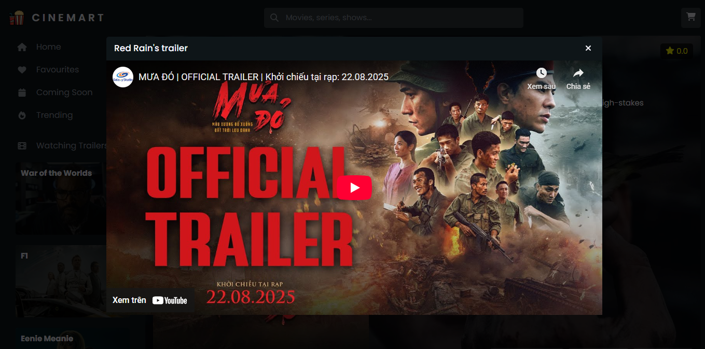

# Odin Shopping Cart

## 📖 Overview

- A shopping cart web application built as part of The Odin Project
  curriculum. This project focuses on practicing React, React Router, and state management by creating a simple e-commerce experience with product browsing and cart functionality.
- See the project in action: [Cinemart](https://odin-shopping-cart-xi-liart.vercel.app/)

## 🚀 Features

- Browse a list of products with images and details.
- Add and remove items from the cart.
- Update item quantities directly in the cart.
- Dynamic cart total calculation.
- Responsive design for desktop and mobile.
- Client-side routing with React Router.

## 🛠️ Built With

- [React](https://react.dev/)
- [React Router](https://reactrouter.com/)
- [SCSS](https://sass-lang.com/) and [CSS Module](https://create-react-app.dev/docs/adding-a-css-modules-stylesheet/)
- [Vite](https://vite.dev/)

## ⚙️ Installation & Usage

1. Clone the repository:

```
git clone https://github.com/zadnap/odin-shopping-cart
```

```
cd odin-shopping-cart
```

2. Install dependencies:

```
npm install
```

3. Run the development server:

```
npm run dev
```

## 🎯 Learning Outcomes

Through this project, I practiced:

- Using React Router for multi-page navigation.
- Using third-party API for fetching data.
- Managing state across components (lifting state up).
- Handling cart logic (quantities, totals, edge cases).
- Writing cleaner, modular code with reusable components.
- Unit testing and test-driven development.
- Building responsive layouts.

## 📚 Acknowledgments

- Project idea from [The Odin Project](https://www.theodinproject.com/lessons/node-path-react-new-shopping-cart)
- Movie data from API: [TMDB](https://www.themoviedb.org/)
- Free icons from [Font Awesome](https://fontawesome.com/)
- Free placeholder images from [Freepik](https://www.freepik.com/)

## 📸 Screenshots

- Home page

  

- Movie detail page

  

- Cart page

  

- Trailer modal

  
